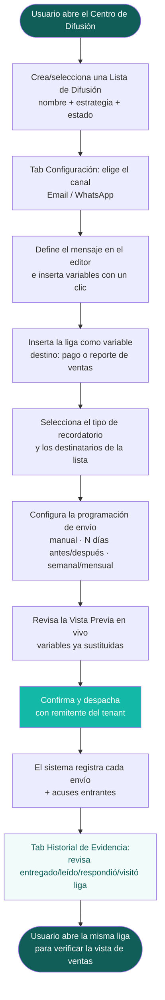

# **Carta a Santa Claus — Requerimientos de Negocio**

## **Listas de Difusión para Cobranza y Comunicación con Inquilinos**

**Solicitante:** Equipo de Producto Colossu / Pod-SaaS (Spot2)
**Audiencia:** Revisión técnica del equipo Colossu → luego equipo de desarrollo externo
**Naturaleza:** Requerimientos de negocio (el QUÉ). El CÓMO técnico lo define el equipo Colossu.
**Versión:** 2.2 (incorpora resolución de comentarios del equipo)
**Fecha:** 2 de junio de 2026

---

## **0. Cómo leer este documento**

Lista de necesidades de negocio, no especificación técnica. Cada punto responde "qué necesita poder hacer el usuario y por qué". Prioridad con MoSCoW: **MUST** (core), **SHOULD** (alto valor v1), **COULD** (deseable después).

---

## **1. El Core**

**En una frase:** Que nuestro usuario (desarrollador inmobiliario / administrador de portafolio) pueda crear **listas de difusión** para enviar **recordatorios y notificaciones personalizadas** a sus inquilinos, de forma **manual o recurrente**, **a su nombre**, incluyendo **ligas configurables** (para pagar, reportar ventas, etc.), y que toda la comunicación quede **respaldada**.

| ID | Requerimiento | Prioridad |
| ----- | ----- | ----- |
| CORE-1 | Agrupar inquilinos en **listas de difusión** segmentadas por criterio (preventivo, mora, aviso, etc.). | MUST |
| CORE-2 | Enviar a esas listas **mensajes personalizados**. Lo configurable son **las ligas y el texto** (vía tags de variable que se llenan con la info elegida). | MUST |
| CORE-3 | Envíos **manuales (ahora)** o **recurrentes/programados**. | MUST |
| CORE-4 | Adjuntar **ligas configurables** que se insertan **manualmente** como variable de plantilla y llevan al inquilino a distintos destinos (pagar, reportar ventas, etc.). | MUST |
| CORE-5 | Los mensajes salen **con la identidad del usuario (remitente real del tenant)**. El usuario asume su propia identidad de cara al inquilino; Colossu es la interfaz, no el remitente visible. | MUST |
| CORE-6 | Toda la comunicación queda **respaldada** y es consultable (ver sección 8 para los elementos respaldados). | MUST |

---

## **2. Listas de Difusión**

| ID | Requerimiento | Prioridad |
| ----- | ----- | ----- |
| LIST-1 | Crear, nombrar y editar listas, cada una con una **estrategia** descriptiva (texto libre). El **canal de envío es configurable** por lista (referencia: prototipo V0). | MUST |
| LIST-2 | Cada lista tiene **identificador legible** (ej. BL-001) y **estado** Activa / Pausada. | MUST |
| LIST-3 | Ver el **conteo de destinatarios** de cada lista. | MUST |
| LIST-4 | Ver el **último envío** de la lista (fecha y hora). | SHOULD |
| LIST-5 | **Pausar** una lista sin perderla, para reactivarla después. | SHOULD |
| LIST-6 | Poblar listas **manualmente** eligiendo inquilinos de la cartera. Los destinatarios **deben existir como contactos** (no son entidades distintas). | MUST |
| LIST-7 | Poblar listas por **regla dinámica** (ej. mora > 30 días). La regla **se evalúa antes de cada envío** (no una sola vez al crearla). | COULD |

---

## **3. Destinatarios — comunicar a personas, no a razones sociales**

**Insight central:** la cobranza falla porque el correo genérico no llega a quien ejecuta el pago. Quien paga suele ser el contador o finanzas, no la razón social firmante. Necesitamos comunicar a **personas con un rol**.

| ID | Requerimiento | Prioridad |
| ----- | ----- | ----- |
| DEST-1 | Cada inquilino puede tener **múltiples contactos** (Representante Legal, Contador, Apoderado, Finanzas). Cada contacto **tiene su rol identificado**; en la UI se muestra el puesto entre paréntesis para mitigar errores de selección. | MUST |
| DEST-2 | Cada contacto tiene **nombre, rol/puesto, email y teléfono**. | MUST |
| DEST-3 | **Agregar, editar y eliminar** contactos de un inquilino de forma sencilla. | MUST |
| DEST-4 | Un envío llega a **los contactos elegidos** del inquilino (el usuario selecciona a quién dirigirlo; no es automáticamente a todos). | MUST |
| DEST-5 | La tarjeta de destinatario muestra contexto: **empresa, propiedad, saldo pendiente y contrato**. | MUST |
| DEST-6 | **Excluir** a un inquilino de envíos automáticos sin sacarlo de la lista (ej. negociación en curso). | SHOULD |
| DEST-7 | Los contactos persisten **a nivel inquilino** (reutilizables en todas las listas). | SHOULD |

---

## **4. Mensajes personalizados**

| ID | Requerimiento | Prioridad |
| ----- | ----- | ----- |
| MSG-1 | Redactar **un mensaje maestro** que se personaliza por destinatario al enviarse. | MUST |
| MSG-2 | **Variables dinámicas** mínimas: nombre del inquilino, monto pendiente, fecha de vencimiento. Las variables se insertan como **tags** que se llenan con la info elegida. | MUST |
| MSG-3 | **Vista previa en vivo** del mensaje con variables sustituidas antes de enviar. | MUST |
| MSG-4 | Insertar variables y ligas con un **clic**, sin escribir código. | SHOULD |
| MSG-5 | El **monto** mostrado respeta IVA 16% y moneda/tipo de cambio (MXN/USD). | MUST |
| MSG-6 | **Guardar y reutilizar plantillas** para distintos escenarios. | SHOULD |
| MSG-7 | El mensaje puede tener **una plantilla por canal** (HTML para email, template aprobado para WhatsApp) compartiendo las mismas variables. | SHOULD |
| MSG-8 | Variables adicionales: concepto y propiedad. | COULD |

---

## **5. Ligas configurables (el corazón de la acción)**

La liga es un **enlace que se inserta como variable de plantilla**, de modo que el destino pueda cambiar (un link simple hoy, una vista más compleja o un formulario de pago externo mañana) **sin afectar la implementación del envío**. Hoy el caso prioritario es el reporte de ventas para renta variable.

| ID | Requerimiento | Prioridad |
| ----- | ----- | ----- |
| LINK-1 | El mensaje puede incluir una **liga** insertada manualmente como variable de plantilla, dirigida a una acción del destinatario. | MUST |
| LINK-2 | **Destino: pago** — el inquilino llega a pagar su adeudo (monto correcto, con IVA/moneda). | MUST |
| LINK-3 | **Destino: reporte de ventas** — el inquilino captura/sube sus ventas del periodo (caso renta variable / RMG). Caso prioritario de uso de ligas. | MUST |
| LINK-4 | La liga abre una **vista pública** (análoga a un formulario compartible): link **sin autenticación** que **almacena el dato de forma segura** en nuestra DB. No requiere ser embebible. | MUST |
| LINK-5 | Cada liga está **vinculada al inquilino y al periodo/adeudo correcto** (no genérica). Lo importante es poder **mantener/actualizar** la liga vigente. | MUST |
| LINK-6 | (Deseable) Seguimiento de estado de la liga: abierta / completada. | COULD |
| LINK-7 | La liga como **variable intercambiable**: cambiar el destino (vista, formulario de pago externo, etc.) sin rehacer la función de envío. | SHOULD |

> Nota: la mecánica fina de las ligas de renta variable se afina junto con el V2 de renta variable (Gabriel Tello), ya que esa función aún no está lista.

---

## **6. Recurrencia y programación**

| ID | Requerimiento | Prioridad |
| ----- | ----- | ----- |
| SCHED-1 | Envío **manual / inmediato** ("enviar ahora"). | MUST |
| SCHED-2 | Envío **automático relativo al vencimiento**: N días antes (preventivo) y N días después (mora). | MUST |
| SCHED-3 | Envío **recurrente en calendario**: semanal o mensual. | SHOULD |
| SCHED-4 | **Resumen en lenguaje natural** de la regla configurada (ej. "envía 5 días antes del vencimiento"). | SHOULD |
| SCHED-5 | **Detener envíos al cumplir**: si el inquilino ya pagó o ya reportó sus ventas, cesan los recordatorios de ese pendiente. | MUST |

---

## **7. Canales, orígenes y consentimiento**

| ID | Requerimiento | Prioridad |
| ----- | ----- | ----- |
| CHAN-1 | Envío por **Email**. | MUST |
| CHAN-2 | Envío por **WhatsApp**. | SHOULD (nice-to-have) |
| CHAN-3 | **Control de desuscripción / consentimiento**: el usuario decide si activa o desactiva la opción de baja para sus inquilinos. Debe ofrecerse un método de des-suscripción para no caer en SPAM. | MUST |
| CHAN-4 | **Orígenes del tenant**: el usuario envía con **su propia identidad** (remitente real del tenant). | MUST |

> Notas para el equipo de build:
> - **WhatsApp y anti-SPAM:** se deben definir plantillas en la cuenta de Meta Business y usar ese template ID en cada envío. No se marca como SPAM siempre que (a) se ofrezca método de des-suscripción y (b) nos apeguemos a la categoría declarada. En nuestro caso la categoría es **"Utility"** (no promocional, personalizado y esencial para la operación del inquilino). Referencia: documentación de categorización de plantillas de WhatsApp.
> - **Identidad / remitente del tenant:** v1 asume la identidad del cliente como remitente real (enviamos "como si fuéramos ellos"). Existe un RFC en backlog para que el usuario configure su marca; mientras tanto, el mínimo es **omitir el diseño/branding de Colossu** en la comunicación. La verificación de orígenes (dominio SPF/DKIM para mail; número en WhatsApp Business) debe dimensionarse.

---

## **8. Respaldo de la comunicación**

**Elementos a respaldar por cada envío (key elements):** mensaje, destinatario, canal, estado de acuse, liga incluida, timestamp **y copia del contenido exacto enviado**.

| ID | Requerimiento | Prioridad |
| ----- | ----- | ----- |
| BKP-1 | **Backup de todos los mensajes enviados**: historial persistente e íntegro, incluyendo **copia del contenido exacto** que recibió cada destinatario. | MUST |
| BKP-2 | **Acuse por mensaje** con estados: Entregado, Leído, Rebotado. | MUST |
| BKP-3 | Registro de **fecha/hora, canal, destinatario y liga/adjunto** de cada envío. | MUST |
| BKP-4 | **Exportar** el historial (CSV/PDF) como prueba documental. | SHOULD |
| BKP-5 | El historial es **inmutable / auditable** (no editable tras el envío). | SHOULD |
| BKP-6 | Historial **filtrable** por lista, inquilino, fecha y estado. | SHOULD |

---

## **9. Experiencia de usuario (UX/UI)**

Requisito explícito: **simple e intuitiva**. El usuario es un administrador, no un operador técnico.

| ID | Requerimiento | Prioridad |
| ----- | ----- | ----- |
| UX-1 | UI **sencilla e intuitiva**, minimalista y espaciosa (referencia Attio). | MUST |
| UX-2 | Configurar recurrencia **sin escribir código** (controles visuales + resumen en lenguaje natural). | MUST |
| UX-3 | **Vista previa** antes de cualquier envío. | MUST |
| UX-4 | Navegación clara entre **listas, mensaje, destinatarios e historial** en un solo lugar. | MUST |
| UX-5 | **Confirmación previa** antes de un despacho masivo. | MUST |
| UX-6 | Feedback visual de estado (activa/pausada, entregado/leído/rebotado). | SHOULD |
| UX-7 | Interfaz y mensajes en **español de México**, formato local de moneda y fecha. | MUST |

---

## **9.5. User Flow — Happy Path**

Recorrido feliz del usuario (desarrollador / administrador) interactuando con la vista del Centro de Difusión (referencia: prototipo V0), desde que configura la lista hasta que revisa la evidencia y visita la liga enviada. **Todo se opera como lista de difusión.**

**Paso a paso (sobre la vista):**

1. **Abre el Centro de Difusión** y crea o selecciona una **Lista de Difusión** (nombre, estrategia, estado Activa/Pausada).
2. En el tab **Configuración**, elige el **canal** de envío de la lista.
3. **Define el mensaje** en el editor e inserta las **variables** con un clic (nombre, monto, vencimiento).
4. **Inserta la liga** como una variable más, apuntada a su destino (pago o reporte de ventas).
5. Elige el **tipo de recordatorio** y selecciona los **destinatarios** de la lista (con el puesto visible para no equivocar al contacto).
6. Configura la **programación de envío**: manual ahora, o automática (N días antes/después del vencimiento, semanal, mensual), con el resumen en lenguaje natural.
7. Revisa la **Vista Previa** con las variables ya sustituidas.
8. **Confirma y despacha**; sale con el remitente del tenant.
9. El sistema **registra cada envío y sus acuses** conforme llegan.
10. En el tab **Historial de Evidencia** revisa los estados (entregado, leído, respondió, visitó la liga) y puede exportarlos.
11. Puede **abrir la misma liga** que envió para verificar la vista donde el inquilino mete sus ventas.

---

## **9.6. Historias de Usuario (use cases con el producto)**

Tres recorridos reales usando el producto. La terminología de los eventos ("visitó liga", "respondió", etc.) se alinea con el bloque de eventos que necesitamos de Spark (sección 16.5).

### **HU-A — Renta variable: liga para reportar ventas (end-to-end)**

> *Como administradora de un centro comercial, quiero pedirle a mis locatarios de renta variable que reporten sus ventas del mes, para poder calcular el excedente variable y cobrarlo.*

1. La administradora crea la lista **"Reporte de ventas — Mensual"** y selecciona a los locatarios con contrato de renta variable (RMG).
2. Redacta el mensaje: *"Hola {inquilino}, es momento de reportar tus ventas de {periodo}. Captúralas aquí: {liga}"*, e inserta la **liga con destino reporte de ventas**.
3. Programa el envío para el **día 1 de cada mes**.
4. El locatario (ej. Starbucks Torre Polanco) **recibe** el mensaje, **abre la liga** (vista pública sin login) y **captura su cifra de ventas** del periodo.
5. Colossu recibe el dato, calcula `max(RMG, ventas × %)` y deja de recordarle a ese locatario (ya reportó).
6. La administradora ve en el **Historial** que el locatario **visitó la liga** y **completó** la captura.

**Eventos de mensajería involucrados:** enviado → entregado → leído → visitó liga → completó acción. (Spark debe reportarlos; ver 16.5.)

### **HU-B — Cobranza preventiva (recordatorio antes de vencer)**

> *Como administrador, quiero avisar a mis inquilinos unos días antes de su vencimiento, para que paguen a tiempo y reducir mi cartera vencida.*

1. El administrador crea la lista **"Recordatorio Preventivo"** con los inquilinos cuyo cargo vence pronto.
2. Redacta un mensaje cordial con `{monto_pendiente}` y `{fecha_vencimiento}`, e inserta la **liga de pago**.
3. Programa el envío **5 días antes del vencimiento** (resumen en lenguaje natural confirmando la regla).
4. Cada inquilino recibe su recordatorio personalizado con su monto real.
5. Quien paga deja de recibir recordatorios de ese cargo; el resto sigue el flujo de mora.

**Eventos de mensajería involucrados:** enviado → entregado → leído → (opcional) visitó liga → pagó.

### **HU-C — Mora con insistencia + evidencia de notificación**

> *Como administrador, quiero insistir en el cobro a un inquilino moroso de forma recurrente y conservar el comprobante de que lo notifiqué, para tener evidencia ante una eventual disputa o proceso de cartera vencida.*

1. El administrador crea la lista **"Mora — Insistencia"** y agrega a los inquilinos con cargos vencidos.
2. Redacta un mensaje formal de cobranza con el adeudo y la **liga de pago**, y lo programa **recurrente cada 3 días después del vencimiento**.
3. El sistema **despacha en cada ciclo** y **respalda cada envío con copia exacta del contenido, destinatario, fecha y acuse** (entregado/leído).
4. Aunque el inquilino no responda, **queda registrado** que se le notificó en cada intento.
5. Si el caso escala, el administrador **exporta el Historial de Evidencia** (CSV/PDF) como **prueba documental** de que se le requirió el pago de forma reiterada.

**Por qué importa:** este caso es clave porque el valor no está solo en cobrar, sino en que **cada notificación es evidencia legal**. El respaldo íntegro y los acuses son el entregable de negocio, no un extra.

**Eventos de mensajería involucrados:** enviado → entregado → leído / rebotado → (registro por cada intento recurrente).

---

## **10. Reglas y salvaguardas**

| ID | Requerimiento | Prioridad |
| ----- | ----- | ----- |
| RULE-1 | **No duplicar adeudos**: monto y vencimiento siempre desde la fuente de verdad vigente del inquilino. | MUST |
| RULE-2 | **Detener al cumplir**: ya pagó / ya reportó → cesan recordatorios de ese pendiente. | MUST |
| RULE-3 | **Anti-fatiga y anti-SPAM**: método de desuscripción + categoría Utility en WhatsApp. | MUST |
| RULE-4 | Las comunicaciones salen con la **identidad del usuario** (sin branding de Colossu). | MUST |

---

## **11. Contexto mexicano (no negociable)**

| ID | Requerimiento | Prioridad |
| ----- | ----- | ----- |
| MX-1 | Montos con **IVA 16%**. | MUST |
| MX-2 | Moneda **MXN y USD** con tipo de cambio. | MUST |
| MX-3 | Manejo de **RFC** y razón social del inquilino en los registros. | MUST |
| MX-4 | **Datos personales** conforme a LFPDPPP (contactos = PII: email, teléfono, RFC). | MUST |

---

## **12. Privacidad y seguridad**

| ID | Requerimiento | Prioridad |
| ----- | ----- | ----- |
| SEC-1 | Datos de contacto = información sensible: protegidos en almacenamiento, logs y exportaciones. | MUST |
| SEC-2 | Las **ligas** abren una vista pública sin autenticación, pero **almacenan el dato de forma segura** (sin exponer datos sensibles en la URL). | MUST |
| SEC-3 | Solo el usuario dueño de la cartera ve y envía a sus listas (**aislamiento por tenant**). | MUST |

---

## **13. Métricas de éxito (con explicación)**

| Métrica | Qué mide | Por qué importa |
| --- | --- | --- |
| **Reducción de DSO** (Days Sales Outstanding) | Días promedio que tarda el usuario en cobrar la renta desde su vencimiento. | Es el indicador madre: si la comunicación dirigida funciona, el dinero entra más rápido. |
| **Tasa de lectura** | % de mensajes enviados que alcanzan estado "Leído". | Mide si el mensaje llega y se abre; si es baja, el canal o el destinatario están mal. |
| **Tasa de cumplimiento de liga** | % de inquilinos que completan la acción de la liga (pagar o reportar ventas). | Mide si la liga convierte: el objetivo final no es que lean, sino que actúen. |
| **Cobertura multi-contacto** | % de inquilinos con ≥2 contactos activos (ej. también el contador). | Proxy de que el mensaje llega a quien ejecuta el pago, no solo al firmante. |
| **Adopción** | % de usuarios con al menos una campaña recurrente activa. | Mide si la función se vuelve parte de la operación, no un experimento de una vez. |
| **Reducción del trabajo manual** | Menos envíos individuales hechos a mano por el usuario. | Valida la promesa de que Colossu "hace el trabajo sucio" de la cobranza. |

---

## **14. Fuera de alcance — PARA DESPUÉS**

Explícito para no inflar el alcance del equipo de build:

* **Facturación / CFDI** (emisión, timbrado, adjunto automático de factura) → **fase posterior**.
* Conciliación / reconciliación bancaria automática → fase posterior.
* Gestión de cuentas bancarias y CLABE → vive en configuración de cobranza, fuera de aquí.
* Portal de inquilino completo con login → solo se contempla acceso seguro sin login para ligas/acuses.
* Aplicación de incrementos de renta → solo se notifican; la aplicación es del módulo de contratos.
* **Módulo de marca del tenant** → existe RFC en backlog; v1 solo omite el branding de Colossu.
* **Mecánica fina de ligas de renta variable** → se define con el V2 de renta variable (Gabriel Tello).

---

## **15. Definiciones cerradas en la revisión técnica (Colossu)**

Bitácora de los comentarios resueltos en la revisión del 2 de junio (Josue Contreras, José Ignacio Arreola, Gabriel Tello):

| Tema | Pregunta | Resolución |
| --- | --- | --- |
| Configurabilidad | ¿Solo ligas y texto son configurables? | Sí, ligas y texto (vía tags de variable). |
| Inserción de ligas | ¿Automáticas o manuales? | Manuales, pensando en renta variable (V2 con Gabriel). |
| Destino de liga | ¿Qué es un destino nuevo? | La liga es una variable de plantilla intercambiable; el destino puede cambiar sin tocar el envío. |
| Vista de la liga | ¿Pública o privada aislada? | Vista pública sin autenticación, análoga a formulario compartible; guarda el dato seguro en DB. |
| Poblar listas | ¿Existen como contactos? | Sí, deben existir como contactos. |
| Regla dinámica | ¿Se evalúa una vez o por envío? | Antes de cada envío. |
| Rol de contacto | ¿Podemos identificar el rol? | Sí; se elige al contacto directo y se muestra el puesto entre paréntesis. |
| Contacto destino | ¿A todos o a elegidos? | A los contactos elegidos por el usuario. |
| Canal por lista | ¿Configurable o fijo? | Configurable. |
| Remitente | ¿Somos remitente o interfaz? | **Remitente real del tenant**: asumimos la identidad del cliente; Colossu es la interfaz y omite su propio branding. |
| Desuscripción | ¿Cómo evitar SPAM con externos? | Método de des-suscripción + categoría WhatsApp "Utility"; el usuario activa/desactiva la baja. |
| Respaldo | ¿Qué key elements se respaldan? | Mensaje, destinatario, canal, acuse, liga, timestamp **y copia del contenido exacto enviado**. |
| Métricas | No quedaban claras | Explicadas en la sección 13. |

---

## **16. Preguntas técnicas que quedan a criterio del equipo de build**

(De la revisión previa, sin cambio: el QUÉ está definido, el CÓMO es de ellos.)

1. Mecanismo de acuses (webhooks, polling, etc.) — libre, mientras se respalden (BKP-2).
2. Método de autenticación (JWT/Passport/OAuth2) — libre, cumpliendo SEC-2 y SEC-3.
3. Estructura exacta del payload de envío (array de contactos + plantilla por canal + variables).
4. Selección de pasarela de pago para la liga de pago.
5. Implementación de verificación de orígenes del tenant (SPF/DKIM, número WhatsApp).

---

## **16.5. Eventos de mensajería que necesitamos de Spark (feedback loop)**

Para que el Historial de Evidencia, el "detener al cumplir" y las métricas funcionen, necesitamos que Spark nos **reporte de vuelta los eventos del ciclo de vida de cada mensaje y de la liga**. Estos eventos son el insumo de todo el respaldo (sección 8) y de los use cases de arriba.

**El mecanismo de entrega lo propone Spark** (webhook, API consultable, cola de eventos, etc.). Lo que pedimos es que se cubran al menos los siguientes eventos. Cada evento debería venir asociado al envío, al destinatario y a un timestamp.

Eventos propuestos:

- **enviado** — el mensaje salió de la plataforma hacia el canal.
- **entregado** — el canal confirmó la recepción en el destino.
- **leído / abierto** — el destinatario abrió el mensaje (apertura de email, doble check azul en WhatsApp).
- **respondió** — el destinatario contestó el mensaje.
- **visitó liga** — el destinatario abrió la liga que enviamos (clave para el caso de reporte de ventas y de pago).
- **completó acción** — el destinatario terminó la acción de la liga (reportó ventas / pagó).
- **rebotado** — la entrega falló (correo inexistente, número inválido, etc.).
- **error de envío** — fallo del lado de la plataforma o del canal al intentar despachar.
- **fuera de ventana / plantilla rechazada** — para WhatsApp: el mensaje no pudo enviarse por ventana de sesión o plantilla no aprobada por Meta.
- **desuscripción** — el destinatario pidió dejar de recibir mensajes (anti-SPAM).

Por cada evento esperamos, como mínimo: identificador del envío, identificador del destinatario, canal, tipo de evento, timestamp y —cuando aplique— detalle del error o metadato de la liga.

---

*Documento actualizado tras la revisión técnica del 2 de junio de 2026. Pendientes mayores cerrados; la mecánica de renta variable y el módulo de marca se afinan en fases posteriores.*
